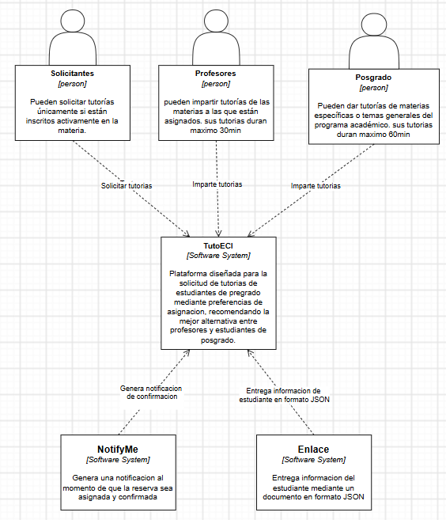
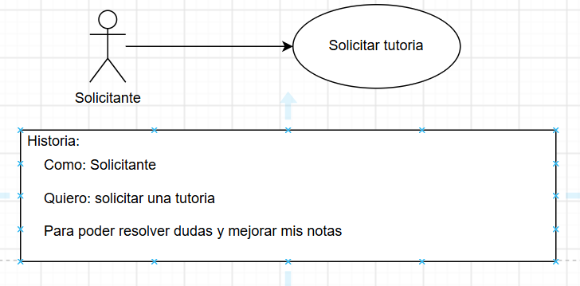

# DOSW_ParcialT1_DanielIba-ez

## Diagrama C4 TutoECI

# Requerimientos del Sistema

## 1. Lista general de requerimientos

El sistema de TutiECI tiene los siguientes requerimientos:

### 1.1 Requerimientos funcionales

El sistema de TutoECi debe tener la capacidad de:

1. Permitir a estudiantes de pregrado de la escuela solicitar tutorias indicando una preferencia de asignacion 

2. El Sistema debe validar las materias del estudiante mediante la informacion entregada por enlace

3. (Strategy)El Sistema debe ser capaz de escoger un tutor basandose en las distintas preferencias de busqueda(FASTEST_AVAILABLE / EXPERT_FIRST / PEER_TUTORING)

### 1.2 Requerimientos no funcionales

El sistema de TechCup debe tener:

4. La interfaz grafica de TutoECI debe ser completamente adaptable

5. La interfaz grafica debe incorporar la identidad visual instutucional respetando la paleta de colores oficial del programa de ingenieria de Sistemas de la escuela

## 2. Diagramas de caso de uso

### 2.1 Requerimiento Funcional 1

| **Campo** | **Descripción** |
| ---------------------------- | ------------------------------------------------------------------------------------- |
| **ID**                       | RF-01 |
| **Nombre del requerimiento** | Solicitar tutorias |
| **Descripción**              | El sistema debe permitir a estudiantes de pregrado de la escuela solicitar tutorias indicando una preferencia de asignacion. |
| **Precondiciones**           | El estudiante de pregrado debe estar inscrito a la escuela y cursar la materia para poder solicitar una tutoria de esta misma. |
| **Actor**                    | Solicitante |
| **Flujo principal**          | 1. El estudiante solicita una tutoria ingresando la preferencia. 2. El sistema solicita el id del estudiante para verificar su informacion. 3. El Sistema verifica la informacion  4. El sistema asigna la tutoria teniendo en cuenta la prerencia designada. 5. El sistema confirma la tutoria. |
| **Diagrama de caso de uso**  |  |
| **Poscondiciones**           | El torneo queda registrado en el sistema y disponible para su posterior gestión |

### 2.2 Requerimiento Funcional 1

| **Campo** | **Descripción** |
| ---------------------------- | ------------------------------------------------------------------------------------- |
| **ID**                       | RF-02 |
| **Nombre del requerimiento** | validar materia |
| **Descripción**              | El Sistema debe validar las materias del estudiante mediante la informacion entregada por enlace |
| **Precondiciones**           | El sistema debe haber verificado que el estudiante este cursando la materia para poder realizar la eleccion y asignacion de tutor. |
| **Actor**                    | Solicitante |
| **Flujo principal**          | 1. El estudiante solicita una tutoria ingresando su id, las sigla de la materia y la preferencia. 2. El sistema solicita mediante el id del estudiante la informacion del mismo 3. El Sistema verifica si el estudiante esta cursando la materia  4. El sistema asigna la tutoria si la verificacion fue verdadera. 5. El sistema confirma la tutoria. |
| **Diagrama de caso de uso**  |  |
| **Poscondiciones**           | El tutoria queda asignada y confirmada de manera correcta |

### 2.3 Requerimiento Funcional 3

| **Campo** | **Descripción** |
| ---------------------------- | ------------------------------------------------------------------------------------- |
| **ID**                       | RF-03 |
| **Nombre del requerimiento** | Eleccion de tutor |
| **Descripción**              | El sistema debe elegir un tutor basandose en las distintas preferencias de busqueda. |
| **Precondiciones**           | El sistema debe haber verificado que el estudiante este cursando la materia para poder realizar la eleccion y asignacion de tutor. |
| **Actor**                    | Solicitante |
| **Flujo principal**          | 1. El estudiante solicita una tutoria ingresando su id, las sigla de la materia y la preferencia. 2. El sistema solicita mediante el id del estudiante la informacion del mismo 3. El Sistema verifica si el estudiante esta cursando la materia  4. El sistema realiza una busqueda de tutor dependiendo de la preferencia designada. 5. El sistema asigna el tutor. 6. el sistema cofirma la tutoria. |
| **Poscondiciones**           | El tutoria queda asignada y confirmada de manera correcta |

### 3. Patrones de diseño

### Patron Strategy
Nombre: Strategy
tipo de patron: comportamiento
justificacion: En este caso escoji strategy ya que como se tienes distintas formas de buscar un tutor dependiendo de la preferencia que uno quiera pues fallo 